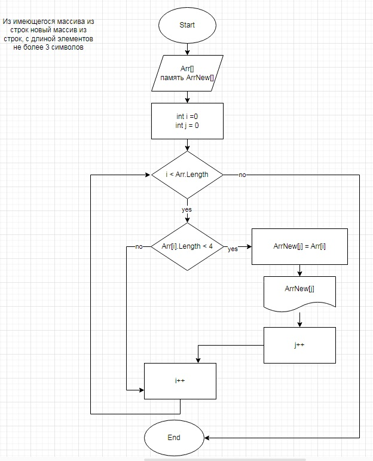

# Описание решения
1. Создаем папку задания.
2. В папке задания создаем новый проект командой "dotnet new console"
3. Для того, чтобы Git отслеживал изменения в папке задания, выполняем инициализацию командой Git init. По мере написания программы фиксируем коммиты (для выполнения каждого коммита добавляем файл Program.cs в отслеживаемые командой Git add, потом делаем коммиты с комментариями о том, что сделано на этапе данного коммита).
4. Переходим в файл Program.cs и пишем программу по алгоритму в соответствии с блок-схемой 
5. Создаем исходный массив.
6. Занимаем память под результирующий массив, длина которого не  может превышать длину  исходного массива.
7. Инициализируем переменные-счётчики числа элементов исходного и результирующего массивов
8. Проходим циклом While по исходному массиву (счетчик элементов i). Каждый элемент исходного массива, который длиной меньше 4 символов (проверяет условный оператор if), записываем в результирующий массив (счетчик элементов j). Выводим на экран результирующий массив.
